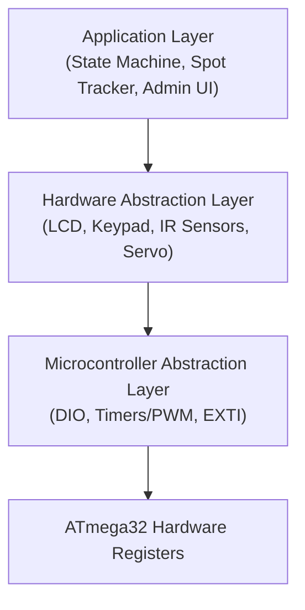
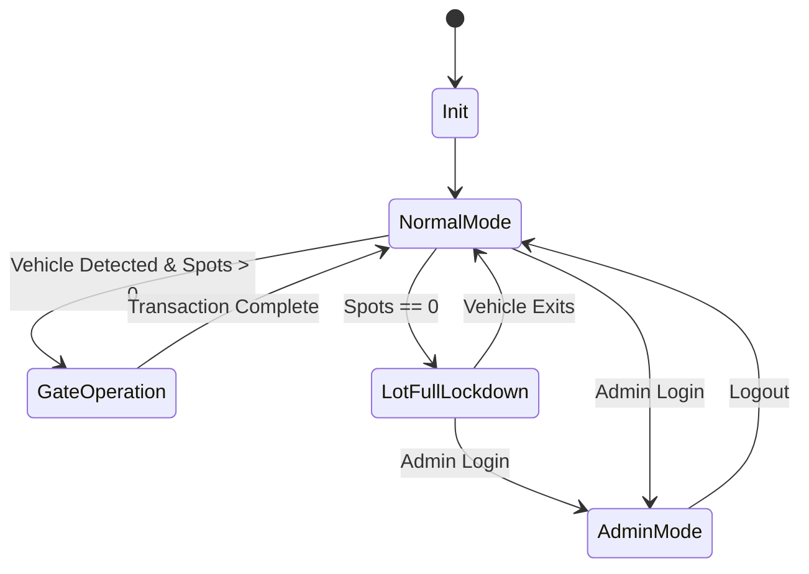
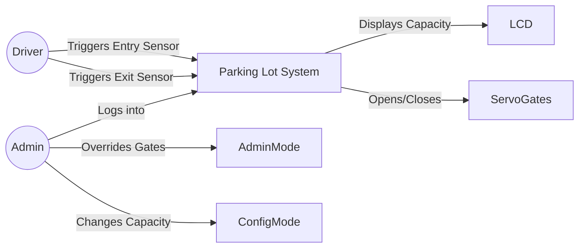
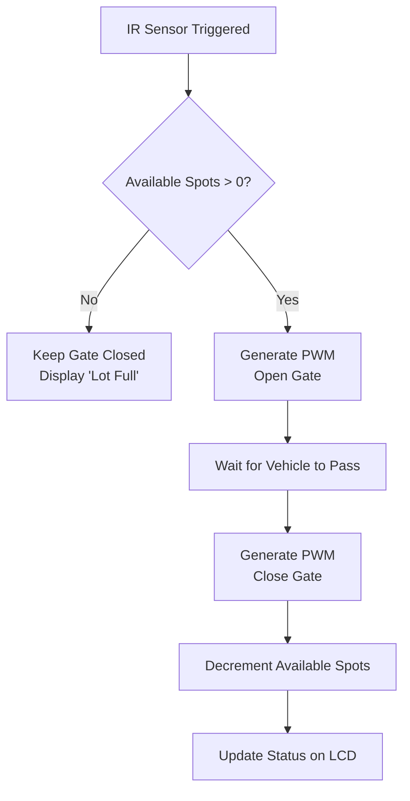

# 🅿️ Automated Parking Lot System

### AVR Embedded Systems Graduation Project

---

**ATmega32 | Embedded C | Layered Architecture | State Machine | Driver Development**

---

# 🚀 Message from the Team Leader

**Hello Team,**

Welcome to the **Automated Parking Lot System** project! As your Team Leader, I want to share my excitement for what we are about to build. Our objective is to design and implement an embedded management system for a parking lot that intelligently controls entry/exit gates, tracks available parking spots, displays real-time lot capacity, and manages security access through an admin interface.

This project will heavily test our skills in **Timers (PWM), Interrupts, and State Machines**, all while adhering to a strict **Layered Architecture (MCAL, HAL, APP)**. Our goal isn't just to make it work, but to make it professional, modular, and fail-safe.

**Important Note:** Before we move to the physical hardware, we will design and simulate the entire circuit using **Proteus Professional**. This will help us test our firmware safely and ensure everything is connected properly.

Below you will find the comprehensive project specifications, system diagrams, and the exact modules we need to deliver. Let's collaborate closely, divide the tasks effectively, and build a masterpiece!

*— Hesham Ahmed, Team Leader*

---

# 📋 Table of Contents

1. [Project Overview](#project-overview)
2. [Functional Requirements](#functional-requirements)
3. [Non-Functional Requirements](#non-functional-requirements)
4. [System Architecture &amp; Layers](#system-architecture--layers)
5. [Hardware Components](#hardware-components)
6. [ATmega32 Pin Assignment](#atmega32-pin-assignment)
7. [Modules &amp; Drivers to Develop](#modules--drivers-to-develop)
8. [System Diagrams](#system-diagrams)
   * [State Machine](#state-machine)
   * [Use Case Diagram](#use-case-diagram)
   * [Vehicle Entry Flow](#vehicle-entry-flow)
9. [Project Organization &amp; Team](#project-organization--team)

---

# 📖 Project Overview

The Automated Parking Lot System is an embedded system built around the **ATmega32 AVR Microcontroller**. It simulates a smart parking garage that tracks the total number of vehicles, controls the physical barrier gates via Servo Motors, and provides a secure Keypad-based admin dashboard to override normal operations or adjust lot capacity.

---

# ⚙️ Functional Requirements

Our system must implement the following core functionalities:

## 1. Vehicle Entry/Exit Detection

* **Entry Detection:** When a vehicle arrives at the entrance, an IR sensor detects it, and the system processes the request.
* **Exit Detection:** When a vehicle leaves, an exit IR sensor updates the system to free up a spot.

## 2. Gate Control (Servo/PWM)

* Use Hardware Timers to generate accurate PWM signals to control the Entry/Exit Servo Motor gates.
* Gates should open smoothly, wait for the vehicle to pass, and close automatically.

## 3. Spot Counting & Display

* Keep track of the total lot capacity and the current number of available spots.
* Continuously display real-time status on the LCD (e.g., "Available Spots: 5").

## 4. Lot Full Lockdown

* When the capacity reaches zero, the system must enter a **Lockdown State**.
* The LCD should display "Lot Full!" and the entry gate **must not open** even if a vehicle is detected at the entrance.

## 5. Admin Override Mode

* A secure Admin interface accessible via the Keypad (Password Protected).
* The Admin can:
  * Manually Open/Close gates in case of emergency.
  * Reset the spot counter.
  * Change the maximum capacity of the parking lot.

---

# 🛡️ Non-Functional Requirements

To ensure a professional software product, the team must adhere to:

* **Modular Design:** Strictly follow the Layered Architecture (MCAL -> HAL -> APP).
* **Interrupt-Driven Approach:** Utilize External Interrupts (EXTI) for IR sensors for immediate response.
* **Accurate Timing:** Use Hardware Timers for PWM instead of software delays to ensure stable Servo movement.
* **Code Reusability:** Write drivers that are portable and independent of the application logic.
* **Memory Optimization:** Keep RAM consumption low.
* **Doxygen Documentation:** All source files, functions, and macros **must** be documented using the **Doxygen** comment style. Every driver file must include a file header block, and every function must have a description, `@param`, and `@return` tags.

---

# 🏗️ System Architecture & Layers

---

# 🔌 Hardware Components

| Component                 | Purpose / Function in Project                     |
| :------------------------ | :------------------------------------------------ |
| **ATmega32**        | Main Microcontroller (Brain of the system)        |
| **LCD 16x2**        | Main User Interface Display (Spots, Alerts, Menu) |
| **Keypad 4x4**      | Admin Input (Passwords, Mode Selection)           |
| **Servo Motor**     | Physical barrier for Entry / Exit Gates           |
| **IR Sensors (x2)** | Vehicle Detection at Entry and Exit               |
| **LEDs**            | Status Indicators (Green = Available, Red = Full) |
| **Push Button**     | Emergency / Admin Menu Trigger                    |

---

# 📌 ATmega32 Pin Assignment

To ensure everyone is on the same page while designing the Proteus schematic and writing the MCAL drivers, here is the unified hardware pin mapping for our ATmega32 microcontroller:

| Port            | Pin            | Hardware Component        | Description                                |
| :-------------- | :------------- | :------------------------ | :----------------------------------------- |
| **PORTA** | `PA0`        | **Green LED**       | Lot has available spots                    |
|                 | `PA1`        | **Red LED**         | Lot is Full                                |
| **PORTB** | `PB0-PB3`    | **Keypad (Rows)**   | Output to Keypad Rows                      |
|                 | `PB4-PB7`    | **Keypad (Cols)**   | Input from Keypad Columns (Pull-up)        |
| **PORTC** | `PC2`        | **LCD RS**          | Register Select                            |
|                 | `PC3`        | **LCD EN**          | Enable (Note: Connect RW to GND)           |
|                 | `PC4`        | **LCD D4**          | Data Line 4 (4-bit mode)                   |
|                 | `PC5`        | **LCD D5**          | Data Line 5 (4-bit mode)                   |
|                 | `PC6`        | **LCD D6**          | Data Line 6 (4-bit mode)                   |
|                 | `PC7`        | **LCD D7**          | Data Line 7 (4-bit mode)                   |
| **PORTD** | `PD2` (INT0) | **Entry IR Sensor** | Detects cars arriving (External Interrupt) |
|                 | `PD3` (INT1) | **Exit IR Sensor**  | Detects cars leaving (External Interrupt)  |
|                 | `PD5` (OC1A) | **Servo Motor**     | Hardware PWM Output for Gate Control       |
|                 | `PD6`        | **Push Button**     | Admin Access / Emergency Override          |

> **Action Item for the Hardware Team:** Please strictly follow this mapping when building the Proteus simulation. This guarantees our software drivers (DIO, EXTI, PWM) will perfectly match the hardware without integration conflicts.

---

# 🛠️ Modules & Drivers to Develop

The team needs to develop the following modules from scratch.
*(Note: Tasks will be divided among the team members)*

### MCAL (Microcontroller Abstraction Layer)

* `DIO`: Digital Input/Output operations.
* `Timers (PWM)`: Specifically Fast PWM mode to control the Servo Motor position.
* `EXTI`: External Interrupts handling for the IR Sensors.

### HAL (Hardware Abstraction Layer)

* `LCD Driver`: Alphanumeric display control.
* `Keypad Driver`: Matrix keypad scanning.
* `Servo Driver`: API to open/close gates by setting specific angles.
* `IR Sensor Driver`: Debouncing and reading state of entry/exit sensors.
* `LED & Button Drivers`: For status indication and manual triggers.

### APP (Application Layer)

To keep the application logic organized, we will divide the APP layer into the following sub-modules:

* `Main State Machine (Scheduler)`: The core loop managing system states (Normal, Full, Admin).
* `Capacity & Spot Tracker`: Logic to increment/decrement available spots and prevent overflow/underflow.
* `Gate Controller`: High-level logic deciding when the gate is allowed to open.
* `Admin UI & Menu Manager`: Manages LCD screen transitions, password entry, and Admin configurations.

---

# 📊 System Diagrams

## State Machine

## Use Case Diagram

## Vehicle Entry Flow

---

# 👥 Project Organization & Team

We will be following an Agile approach, tracking our tasks and ensuring every layer is thoroughly tested before integration.

| Role                  | Name                                 |
| :-------------------- | :----------------------------------- |
| **Coordinator** | **Abdalrhman Akl**             |
| **Team Member** | **Abdelrahman Mohamed Elsawy** |
| **Team Member** | **Abdelrhman Ahmed Elkome**    |
| **Team Member** | **Ahmed Mahmoud Ali Hafny**    |

---

<b>Let's build a smart, efficient, and robust system. Good luck team!</b>  
Embedded Systems Project using <b>ATmega32 AVR Microcontroller</b> 
Made with ❤️ by the Team.

