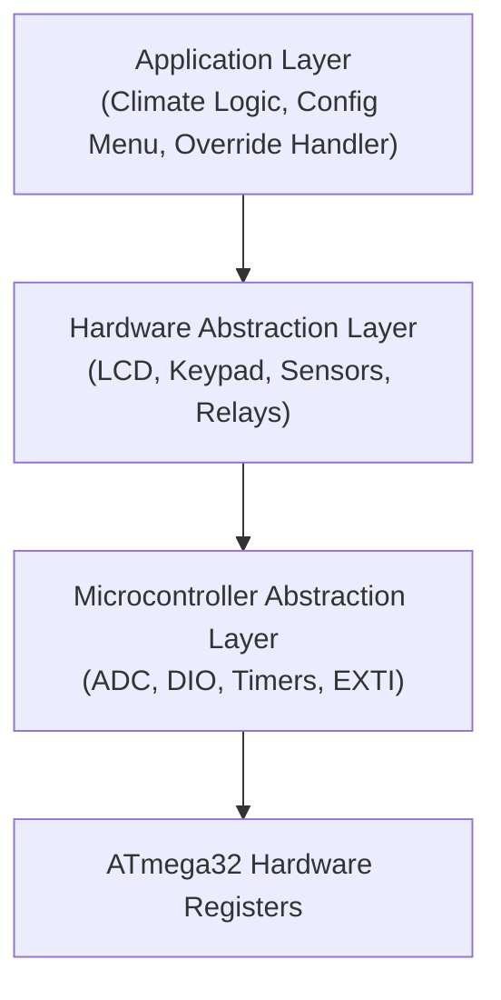
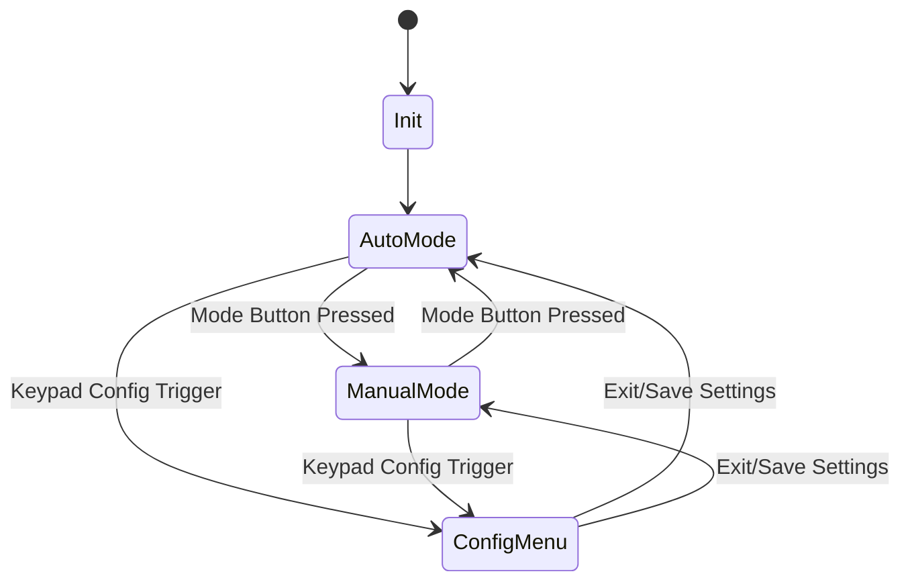
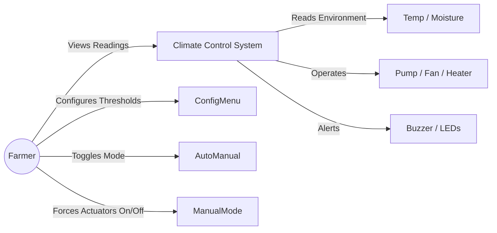
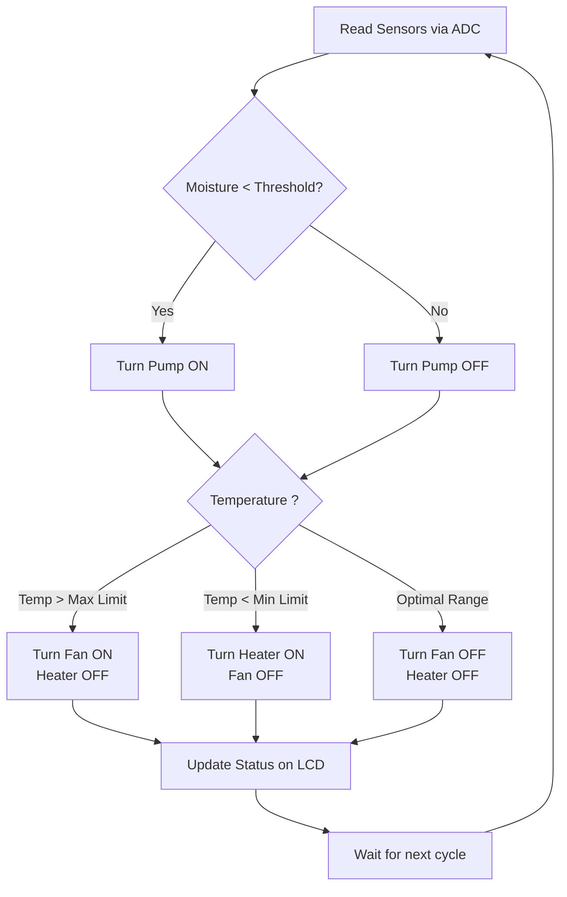

# 🌱 Greenhouse Climate Control System

### AVR Embedded Systems Graduation Project

---

**ATmega32 | Embedded C | Layered Architecture | State Machine | Actuator Control**

---

# 🚀 Message from the Project Coordinator

**Hello Team,**

Welcome to the **Greenhouse Climate Control System** project! I am very excited to coordinate this initiative with all of you. Our objective is to design a highly reliable automated system that monitors vital environmental factors like soil moisture and ambient temperature, and automatically operates actuators such as water pumps, fans, and heaters to maintain the perfect growing conditions for plants.

This project is a fantastic opportunity to master **ADC (Analog reading from sensors), DIO (Relay logic for heavy loads), and Timers**, all while structuring our code based on a professional **Layered Architecture (MCAL, HAL, APP)**. Our system must be robust, as plants depend on the accuracy of our logic!

**Important Note:** Before we move to the physical hardware, we will design and simulate the entire circuit using **Proteus Professional**. This will help us test our firmware safely, especially the relay switching logic, and ensure everything is connected properly.

Let's organize our tasks, write clean and reusable drivers, and build an exceptional system!

— Hesham Ahmed, Team Leader

---

# 📋 Table of Contents

1. [Project Overview](#project-overview)
2. [Functional Requirements](#functional-requirements)
3. [Non-Functional Requirements](#non-functional-requirements)
4. [System Architecture &amp; Layers](#system-architecture--layers)
5. [Hardware Components](#hardware-components)
6. [ATmega32 Pin Assignment](#atmega32-pin-assignment)
7. [Modules &amp; Drivers to Develop](#modules--drivers-to-develop)
8. [System Diagrams](#system-diagrams)
   * [State Machine](#state-machine)
   * [Use Case Diagram](#use-case-diagram)
   * [Climate Control Logic Flow](#climate-control-logic-flow)
9. [Project Organization &amp; Team](#project-organization--team)

---

# 📖 Project Overview

The Greenhouse Climate Control System is an intelligent embedded solution built around the **ATmega32 AVR Microcontroller**. It continuously tracks environmental parameters and takes automated decisions to switch on/off various actuators (Pumps, Fans, Heaters) to keep the greenhouse climate within optimal configured ranges. It also features a manual override mode and a configuration menu via an LCD and Keypad interface.

---

# ⚙️ Functional Requirements

Our system must implement the following core functionalities:

## 1. Climate Monitoring

* Continuously read analog values from the Temperature Sensor (LM35) and the Soil Moisture Sensor.
* Convert raw ADC values into percentage (%) for moisture and Celsius (°C) for temperature.
* Display these readings in real-time on the 16x2 LCD.

## 2. Parameter Configuration Menu

* An interactive menu accessible via the Keypad to set the desired optimal conditions.
* The user can configure:
  * Minimum Soil Moisture Threshold (%).
  * Minimum Temperature (Turns on Heater).
  * Maximum Temperature (Turns on Fan).

## 3. Actuator Control Logic (Auto Mode)

* **Water Pump:** Automatically turns on if Soil Moisture drops below the configured threshold. Turns off when the soil is hydrated.
* **Fan:** Automatically turns on if the Temperature exceeds the maximum limit to cool down the greenhouse.
* **Heater:** Automatically turns on if the Temperature drops below the minimum limit to warm up the environment.

## 4. Auto/Manual Override Modes

* The system should support toggling between **Auto Mode** and **Manual Mode**.
* In Manual Mode, the automated logic is suspended, and the user can independently turn the pump, fan, or heater ON/OFF via Keypad commands.

## 5. Warning Indicators

* Visual and audible alarms (LEDs and Buzzer) if sensor readings reach extreme critical bounds (e.g., bone-dry soil or critically high temperature).

---

# 🛡️ Non-Functional Requirements

To ensure a professional software product, the team must adhere to:

* **Modular Design:** Strictly follow the Layered Architecture (MCAL -> HAL -> APP).
* **Safe Actuator Switching:** Ensure relays do not chatter by implementing hysteresis (e.g., turn on heater at 18°C, turn off at 22°C).
* **Non-Blocking Operations:** Use Timers for periodic checks instead of blocking CPU delays.
* **Code Reusability:** Write drivers that are portable and independent of the application logic.
* **Doxygen Documentation:** All source files, functions, and macros **must** be documented using the **Doxygen** comment style. Every driver file must include a file header block, and every function must have a description, `@param`, and `@return` tags.

---

# 🏗️ System Architecture & Layers

---

# 🔌 Hardware Components

| Component                    | Purpose / Function in Project                 |
| :--------------------------- | :-------------------------------------------- |
| **ATmega32**           | Main Microcontroller (Brain of the system)    |
| **LCD 16x2**           | User Interface (Monitoring & Configuration)   |
| **Keypad 4x4**         | User Input (Menu navigation, Manual Override) |
| **LM35 Sensor**        | Ambient Temperature Monitoring                |
| **Moisture Sensor**    | Soil Moisture Level Monitoring (Analog)       |
| **Relay Modules (x3)** | To switch the Heavy Loads (Pump, Fan, Heater) |
| **Buzzer & LEDs**      | Warning Indicators for critical levels        |
| **Push Button**        | Quick toggle between Auto/Manual Mode         |

---

# 📌 ATmega32 Pin Assignment

To ensure everyone is on the same page while designing the Proteus schematic and writing the MCAL drivers, here is the unified hardware pin mapping for our ATmega32 microcontroller:

| Port            | Pin            | Hardware Component        | Description                         |
| :-------------- | :------------- | :------------------------ | :---------------------------------- |
| **PORTA** | `PA0` (ADC0) | **LM35 Sensor**     | Temperature Analog Input            |
|                 | `PA1` (ADC1) | **Moisture Sensor** | Soil Moisture Analog Input          |
| **PORTB** | `PB0-PB3`    | **Keypad (Rows)**   | Output to Keypad Rows               |
|                 | `PB4-PB7`    | **Keypad (Cols)**   | Input from Keypad Columns (Pull-up) |
| **PORTC** | `PC2`        | **LCD RS**          | Register Select                     |
|                 | `PC3`        | **LCD EN**          | Enable (Note: Connect RW to GND)    |
|                 | `PC4`        | **LCD D4**          | Data Line 4 (4-bit mode)            |
|                 | `PC5`        | **LCD D5**          | Data Line 5 (4-bit mode)            |
|                 | `PC6`        | **LCD D6**          | Data Line 6 (4-bit mode)            |
|                 | `PC7`        | **LCD D7**          | Data Line 7 (4-bit mode)            |
| **PORTD** | `PD2` (INT0) | **Mode Toggle Btn** | Toggle Auto/Manual Mode (Interrupt) |
|                 | `PD3`        | **Relay 1**         | Water Pump Control                  |
|                 | `PD4`        | **Relay 2**         | Cooling Fan Control                 |
|                 | `PD5`        | **Relay 3**         | Heater Control                      |
|                 | `PD6`        | **Buzzer**          | Critical Warning Alarm              |
|                 | `PD7`        | **Red LED**         | Visual Warning Indicator            |

> **Action Item for the Hardware Team:** Please strictly follow this mapping when building the Proteus simulation. This guarantees our software drivers will perfectly match the hardware without integration conflicts.

---

# 🛠️ Modules & Drivers to Develop

The team needs to develop the following modules from scratch.
*(Note: Tasks will be divided among the team members)*

### MCAL (Microcontroller Abstraction Layer)

* `DIO`: Digital Input/Output operations for Relays, LEDs, etc.
* `ADC`: Analog to Digital Conversion (Interrupt/Polling based) for sensors.
* `Timers`: For system ticks, LCD refresh intervals, and non-blocking tasks.
* `EXTI`: External Interrupts handling for the Mode Toggle button.

### HAL (Hardware Abstraction Layer)

* `LCD Driver`: Alphanumeric display control and string formatting.
* `Keypad Driver`: Matrix keypad scanning.
* `Relay Driver`: Safe switching API for actuators.
* `Sensor Drivers`: Wrappers to map raw ADC data to physical values (Temp/Moisture).
* `Alarm Driver`: Buzzer and LED indication control.

### APP (Application Layer)

To keep the application logic organized, we will divide the APP layer into the following sub-modules:

* `Main Scheduler`: The core state machine managing system states (Init, Normal Monitor, Menu, Manual Override).
* `Sensor Processing`: Reads ADC and applies noise filtering and scaling algorithms.
* `Climate Control Logic`: The automated brain that compares sensors against thresholds and applies hysteresis to operate relays.
* `UI & Configuration Manager`: Handles the LCD menus, setting thresholds, and navigating via Keypad.
* `Override Manager`: Bypasses automation logic to allow direct relay control from the user.

---

# 📊 System Diagrams

## State Machine

## Use Case Diagram

## Climate Control Logic Flow (Auto Mode)

---

# 👥 Project Organization & Team

We will be following an Agile approach, tracking our tasks and ensuring every layer is thoroughly tested before integration.

| Role                  | Name                                   | Suggested Responsibilities                               |
| :-------------------- | :------------------------------------- | :------------------------------------------------------- |
| **Coordinator** | **Sama Mohamed Mahmoud**         | Architecture, Main Scheduler, Climate Logic, Integration |
| **Team Member** | **Khaled Mohamed ahmed Mohamed** | MCAL Development (ADC, EXTI, Timers)                     |
| **Team Member** | **Aseel Muhammed El Sayed**      | HAL Development (LCD, Sensors, Relays)                   |
| **Team Member** | **Mohamed sedeek**               | UI Menus, Keypad Integration, Manual Override Logic      |

---
