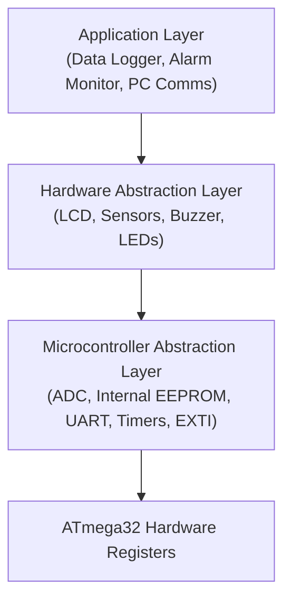
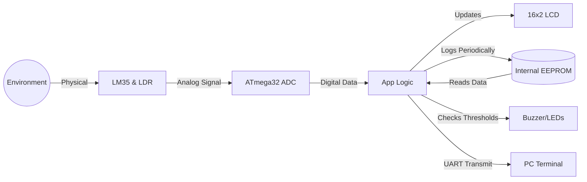
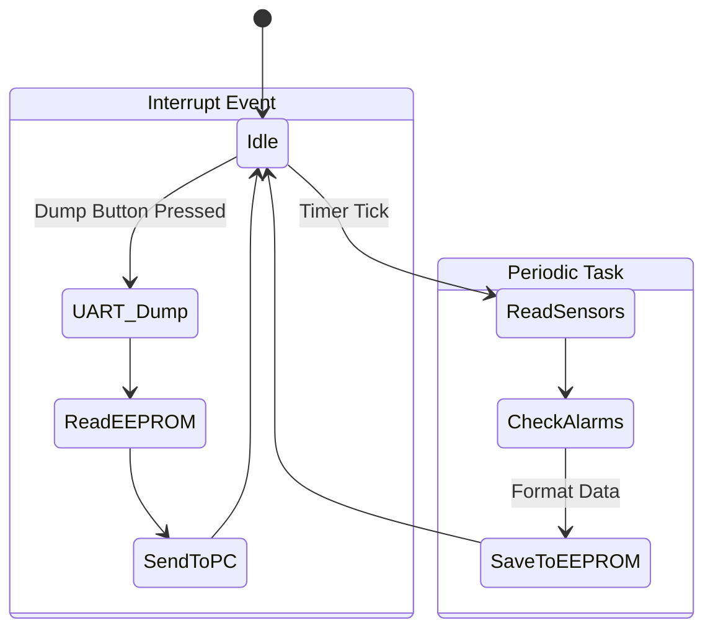

# 🌦️ Weather Monitoring & Data Logging Station

### AVR Embedded Systems Graduation Project

---

**ATmega32 | Embedded C | Layered Architecture | Data Logging | UART Communication**

---

# 🚀 Message from the Team Leader

**Hello Team,**

Welcome to the **Weather Monitoring & Data Logging Station** project! I am thrilled to work with you all on building this robust environmental monitoring system. Our main goal is to design a system that not only reads sensor data (like temperature and light) accurately but also logs this historical data securely and transmits it to a PC for further analysis.

This project will heavily challenge our skills in **ADC (Analog to Digital Conversion)**, **EEPROM Memory Management**, and **UART Communication protocols**. As always, we will strictly follow a professional **Layered Architecture (MCAL, HAL, APP)** to ensure our code is scalable and maintainable.

**Important Note:** Before we move to the physical hardware, we will design and simulate the entire circuit using **Proteus Professional**. This will help us test our firmware safely and ensure everything is connected properly.

Let's distribute the tasks, write clean drivers, and build a highly reliable station!

— Hesham Ahmed, Team Leader

---

# 📋 Table of Contents

1. [Project Overview](#project-overview)
2. [Functional Requirements](#functional-requirements)
3. [Non-Functional Requirements](#non-functional-requirements)
4. [System Architecture &amp; Layers](#system-architecture--layers)
5. [Hardware Components](#hardware-components)
6. [ATmega32 Pin Assignment](#atmega32-pin-assignment)
7. [Modules &amp; Drivers to Develop](#modules--drivers-to-develop)
8. [System Diagrams](#system-diagrams)
   * [Data Flow Architecture](#data-flow-architecture)
   * [Data Logging &amp; Dump Flow](#data-logging--dump-flow)
9. [EEPROM Memory Layout](#eeprom-memory-layout)
10. [Project Organization &amp; Team](#project-organization--team)

---

# 📖 Project Overview

The Weather Monitoring Station is an embedded system built around the **ATmega32 AVR Microcontroller**. It continuously reads environmental data using analog sensors, displays real-time updates on a local LCD, logs historical data into the internal non-volatile memory (EEPROM), and can communicate with a PC via UART to dump the collected data or trigger threshold alarms.

---

# ⚙️ Functional Requirements

Our system must implement the following core functionalities:

## 1. Real-Time Sensor Reading

* Continuously read analog values from the Temperature Sensor (LM35) and Light Sensor (LDR).
* Convert raw ADC values into meaningful physical units (Celsius and Lux/Percentage).

## 2. Local Status Display

* Display the real-time sensor readings on the 16x2 LCD.
* The UI should update smoothly without flickering or blocking the main system loop.

## 3. Data Logging & Retrieval

* Periodically save sensor readings into the **Internal EEPROM** to keep a history of the environmental changes.
* Ensure EEPROM addresses are managed efficiently to avoid overwriting un-dumped data.

## 4. Threshold Alarms

* Compare live sensor data against pre-configured safety thresholds.
* If thresholds are exceeded (e.g., Temperature > 45°C), trigger local alarms (Buzzer & Warning LEDs) and display a warning on the LCD.

## 5. PC Communication for Data Dump

* Establish a serial connection with a PC terminal using the **UART protocol**.
* Upon receiving a specific command (via Push Button or UART Rx), the system must "dump" (transmit) all historical data logged in the EEPROM to the PC.

---

# 🛡️ Non-Functional Requirements

To ensure a professional software product, the team must adhere to:

* **Modular Design:** Strictly follow the Layered Architecture (MCAL -> HAL -> APP).
* **Non-Blocking Operations:** Use Timers for periodic logging instead of software `_delay_ms()`.
* **Data Integrity:** Handle EEPROM Read/Write cycles carefully to avoid data corruption.
* **Code Reusability:** Write drivers that are portable and independent of the application logic.
* **Doxygen Documentation:** All source files, functions, and macros **must** be documented using the **Doxygen** comment style. Every driver file must include a file header block, and every function must have a description, `@param`, and `@return` tags.

---

# 🏗️ System Architecture & Layers

---

# 🔌 Hardware Components

| Component                     | Purpose / Function in Project              |
| :---------------------------- | :----------------------------------------- |
| **ATmega32**            | Main Microcontroller (Brain of the system) |
| **LCD 16x2**            | Local UI for real-time readings            |
| **LM35 Sensor**         | Temperature Monitoring                     |
| **LDR Sensor**          | Ambient Light Monitoring                   |
| **Internal EEPROM**     | Non-Volatile storage for data logging      |
| **UART (CH340/MAX232)** | Serial communication with PC               |
| **LEDs & Buzzer**       | Alarm indication for exceeded thresholds   |
| **Push Buttons**        | Triggers for Manual Data Dump / Reset      |

---

# 📌 ATmega32 Pin Assignment

To ensure everyone is on the same page while designing the Proteus schematic and writing the MCAL drivers, here is the unified hardware pin mapping for our ATmega32 microcontroller:

| Port            | Pin            | Hardware Component      | Description                       |
| :-------------- | :------------- | :---------------------- | :-------------------------------- |
| **PORTA** | `PA0` (ADC0) | **LM35 Sensor**   | Temperature Analog Input          |
|                 | `PA1` (ADC1) | **LDR Sensor**    | Light Analog Input                |
| **PORTC** | `PC2`        | **LCD RS**        | Register Select                   |
|                 | `PC3`        | **LCD EN**        | Enable (Note: Connect RW to GND)  |
|                 | `PC4`        | **LCD D4**        | Data Line 4 (4-bit mode)          |
|                 | `PC5`        | **LCD D5**        | Data Line 5 (4-bit mode)          |
|                 | `PC6`        | **LCD D6**        | Data Line 6 (4-bit mode)          |
|                 | `PC7`        | **LCD D7**        | Data Line 7 (4-bit mode)          |
| **PORTD** | `PD0` (RXD)  | **UART Terminal** | Receive Commands from PC          |
|                 | `PD1` (TXD)  | **UART Terminal** | Transmit Logged Data to PC        |
|                 | `PD2` (INT0) | **Dump Button**   | Trigger EEPROM Data Dump via UART |
|                 | `PD3` (INT1) | **Clear Button**  | Clear EEPROM Logs                 |
|                 | `PD4`        | **Buzzer**        | General Alarm Output              |
|                 | `PD5`        | **Red LED**       | High Temperature Warning          |
|                 | `PD6`        | **Yellow LED**    | Light Threshold Warning           |

> **Action Item for the Hardware Team:** Please strictly follow this mapping when building the Proteus simulation. This guarantees our software drivers will perfectly match the hardware without integration conflicts.

---

# 🛠️ Modules & Drivers to Develop

The team needs to develop the following modules from scratch.
*(Note: Tasks will be divided among the team members)*

### MCAL (Microcontroller Abstraction Layer)

* `DIO`: Digital Input/Output operations.
* `ADC`: Analog to Digital Conversion (Interrupt/Polling based).
* `UART`: Serial communication protocol.
* `Internal EEPROM`: API for non-volatile read/write byte/block.
* `Timers`: Ticks for periodic data logging.
* `EXTI`: External Interrupts for instantaneous push button triggers.

### HAL (Hardware Abstraction Layer)

* `LCD Driver`: Alphanumeric display control.
* `Sensor Drivers`: ADC wrapper for LM35 and LDR mapping.
* `LED & Buzzer Drivers`: Output control for alarms.
* `Push Button Driver`: External button reading (Interrupt driven).

### APP (Application Layer)

To keep the application logic organized, we will divide the APP layer into the following sub-modules:

* `Main Scheduler`: Core loop executing periodic tasks without blocking.
* `Sensor Manager`: Handles reading sensors and applying noise filters/conversions.
* `Data Logger`: Manages EEPROM addresses, formatting, and saving data periodically.
* `Alarm Monitor`: Constantly checks sensor readings against configured thresholds.
* `PC Communication Protocol`: Formats EEPROM data into readable strings (e.g., CSV or JSON) and transmits via UART.
* `UI Display Manager`: Updates local LCD safely.

---

# 📊 System Diagrams

## Data Flow Architecture

## Data Logging & Dump Flow

---

# 💾 EEPROM Memory Layout

We must structure our EEPROM to track where to save the next reading.

| Address Range        | Data Stored               | Description                                                 |
| :------------------- | :------------------------ | :---------------------------------------------------------- |
| `0x00` - `0x01`  | **Log Pointer**     | Stores the address of the next empty EEPROM slot (2 bytes). |
| `0x02`             | **Temp Threshold**  | Configurable Temperature Alarm limit.                       |
| `0x03`             | **Light Threshold** | Configurable Light Alarm limit.                             |
| `0x10` - `0x3FF` | **Sensor Data Log** | Array of struct`{Temp, Light}` recorded periodically.     |

---

# 👥 Project Organization & Team

We will be following an Agile approach, tracking our tasks and ensuring every layer is thoroughly tested before integration.

| Role                  | Name                                    |
| :-------------------- | :-------------------------------------- |
| **Coordinator** | **Abdelrahman Mohamed Ibrahim**   |
| **Team Member** | **Abdelrahman Ibrahim abdelbary** |
| **Team Member** | **Youssef mohamed ghait**         |
| **Team Member** | **Mohamed Raafat Hassan**         |

---

<b>Let's build a smart, efficient, and robust system. Good luck team!</b>  
Embedded Systems Project using <b>ATmega32 AVR Microcontroller</b> 
Made with ❤️ by the Team.

